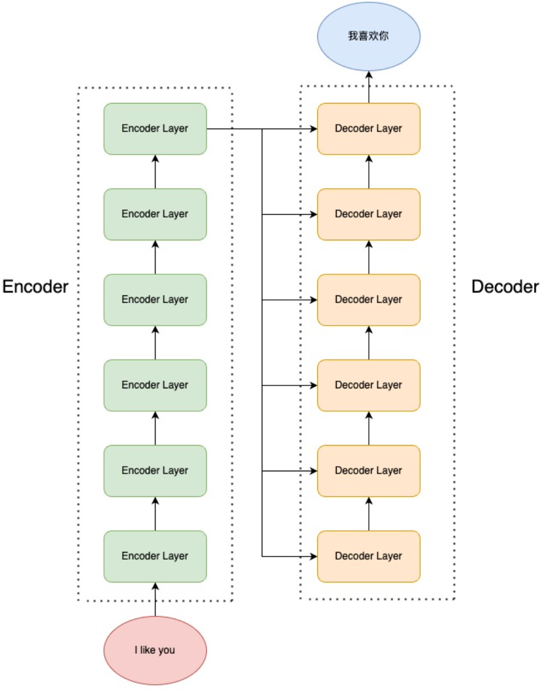

# Transformer 架构

## 注意力机制

- `RNN` 以及 `LSTM、GRU` 等网络结构的缺点:
  - 序列依序计算的模式虽然可以模拟时序信息, 但是限制了计算机并行计算的能力
  - `RNN` 难以捕捉长序列的相关关系, 在 `RNN` 架构中, 距离越远的输入之间的关系越难被捕捉
- 注意力机制: 包含 `Q、K、V` 三个核心变量, 其中 `K、V` 可以作为整个训练集本身的特征以及标签属性, 同时 `Q` 作为查询变量, `Q` 对应的输出值取决于 `Q` 和`K` 之间的关系, `Q、K` 经过一定运算得到注意力权重之后, 利用注意力权重作为加权求解 `V` 的加权和从而得到最终 `Q` 对应的输出

### 缩放点积注意力

首先考虑词向量, 对于词向量可以使用余弦相似度来表示词向量对应的词的关联度, 所以这里可以使用点积来表示 `Q` 和 `K` 之间的相似度, 对于单个词向量 $q$  ,考虑该词向量关于 中所有词 $K$ 的关联关系, 可以使用点积描述:
$$
x = qK^T
$$
 所以对于单个词向量 $q$ 可以利用 $softmax$ 操作求解 $K$ 中的每一个词对于 $q$ 的关联度权重:
$$
softmax(x)_i = \frac {e^{x_i}}{\sum_j e^{x_j}}
$$
这样得到的向量就可以反应 $K$ 和 $q$ 的关联度大小, 此时考虑整个查询集 $Q$, 此时可以得到 $K$ 关于 $Q$ 的注意力权重可以利用如下方法计算:
$$
attention(Q,K,V) = softmax(QK^T)V
$$
同时由于 $Q、K$ 对应的维度 $d_k$ 可能比较大, 所以 $softmax$ 方所的时候可能容易受到影响, 从而影响梯度之间的稳定性(可能产生梯度消失, $softmax$ 函数在输入较大的时候梯度趋于 $0$ ) , 所以需要进行一个放缩:
$$
attention(Q,K,V) = softmax(\frac {QK^T}{\sqrt {d_k}})V
$$

### 注意力机制实现

缩放点积注意力实现如下:

```Python
# 实现缩放点积注意力
def attention(Q,K,V, dropout=0):
    dim = Q.shape[-1]
    # Q.size -> (batch_size, dim)
    # K.size -> (batch_size, dim)
    attention_weights = Q @ K.transpose(-1, -2) / math.sqrt(dim)
    attention_weights = torch.softmax(attention_weights, dim=-1)
    attention_weights = torch.dropout(attention_weights, dropout, train=True)
    output = attention_weights @ V
    return output, attention_weights
```

### 自注意力

自注意力类似于全连接层或者卷积神经网络以及循环神经网络,  都是从一个序列得到另外一个序列, 但是自注意力机制实际上是对于序列本身关系的学习, 在自注意力机制中 `Q, K, V` 都是输入本身, 实际计算中, `Q, K, V` 都是 `X` 通过对应的参数矩阵 $W_q, W_k, W_v$ 得到的, 自注意力实现如下:

```Python
# 实现自注意力
class SelfAttention(nn.Module):
    def __init__(self, dim, dropout=0.1, **kwargs):
       super(SelfAttention, self).__init__(**kwargs)
       self.dim = dim
       self.w_q = nn.Linear(dim, dim)
       self.w_k = nn.Linear(dim, dim)
       self.w_v = nn.Linear(dim, dim)
       self.dropout = nn.Dropout(dropout)
       self.w_o = nn.Linear(dim, dim)
    def forward(self, X, attention_mask=None):
        # X.size -> (batch_size, seq_len, dim)
        # Q,K,V.size -> (batch_size, seq_len, dim)
        Q, K, V = self.w_q(X), self.w_k(X), self.w_v(X)
        attention_weights = Q @ K.transpose(-1, -2) / math.sqrt(self.dim)
        if attention_mask is not None:
            attention_weights = attention_weights.masked_fill(
                attention_mask == 0,
                float("-inf")
            )
        # attention_weights.size -> (batch_size, seq_len, seq_len)
        attention_weights = torch.softmax(attention_weights, dim=-1)
        attention_weights = self.dropout(attention_weights)
        output = attention_weights @ V
        # output.size -> (batch_size, seq_len, dim)
        output = self.w_o(output)
        return output
```

### 掩码自注意力

掩码自注意力(`Mask Self-Attention`) 表示使用注意力掩码的自注意力机制, 作用是可以屏蔽一些特定位置的 `token`, 从而使得模型在学习的过程中, 屏蔽掉特定的位置的 `token`

`Transformer` 中提出掩码自注意力的方法, 掩码自注意力会生成一串掩码用于屏蔽未来信息, 例如需要学习的信息为 `[BOS] I like you [EOC]` , 为了并行化输入数据到模型中, 可以使得模型输入为:

```Python
<BOS> 【MASK】【MASK】【MASK】【MASK】     -> I
<BOS>    I   【MASK】 【MASK】【MASK】   -> like
<BOS>    I     like  【MASK】【MASK】   -> you
<BOS>    I     like    you  【MASK】   -> </EOS>
<BOS>    I     like    you   </EOS>
```

注意到这几个句子可以出现在同一个批量中, 每一个句子可以当成单个样本, 只需要在单个样本中不透率信息即可

```Python
# 生成掩码
def get_mask(batch_size, seq_len):
    mask = torch.full(size=(1, seq_len, seq_len), fill_value=1)
    mask = 1 - torch.triu(mask, diagonal=1)
    mask = mask.repeat((batch_size, 1, 1))
# 使用掩码
if attention_mask is not None:
            attention_weights = attention_weights.masked_fill(
                attention_mask == 0,
                float("-inf")
            )
```

### 多头注意力

多头注意力的主要作用是可以从多个方面来学习一个序列的特征(例如从语法等方面分别学习)
$$
MultiHead(Q,K,V) = Concat(head_1, \ldots, head_h) W^O \\
where \ head_i = Attention(QW_i^Q, KW_i^K, VW_i^V)
$$
多头注意力实现:

```Python
class MultiHeadAttention(nn.Module):
    def __init__(self, dim, heads, dropout_rate=0.1, **kwargs):
        super(MultiHeadAttention, self).__init__(**kwargs)
        self.hidden_dim = dim // heads
        self.heads = heads
        self.w_q = nn.Linear(dim, dim)
        self.w_k = nn.Linear(dim, dim)
        self.w_v = nn.Linear(dim, dim)
        self.w_o = nn.Linear(dim, dim)
        self.dropout = nn.Dropout(dropout_rate)
    def get_causal_mask(self, batch_size, seq_len):
        mask = torch.full(size=(1, seq_len, seq_len), fill_value=1)
        mask = 1 - torch.triu(mask, diagonal=1)
        mask = mask.unsqueeze(0).repeat((batch_size, self.heads, 1, 1))
        return mask
    def forward(self, X, is_causal=False):
        # X.shape -> (batch_size, seq_len, dim)
        batch_size, seq_len, _ = X.shape
        Q, K, V = self.w_q(X), self.w_k(X), self.w_v(X)
        # Q, K, V.shape -> (batch_size, seq_len, self.heads*self.hidden_dim)
        Q = Q.reshape((batch_size, seq_len, -1, self.hidden_dim)).transpose(-2, -3)
        K = K.reshape((batch_size, seq_len, -1, self.hidden_dim)).transpose(-2, -3)
        V = V.reshape((batch_size, seq_len, -1, self.hidden_dim)).transpose(-2, -3)
        # Q, K, V.shape -> (batch_size, heads, seq_len, hidden_dim)
        attention_weights = Q @ K.transpose(-1, -2) / math.sqrt(self.hidden_dim)
        # attention_weights.shape -> (batch_size, heads, seq_len, seq_len)
        if is_causal:
            mask = self.get_causal_mask(batch_size=batch_size, seq_len=seq_len)
            attention_weights = attention_weights.masked_fill(
                mask == 0,
                float('-inf')
            )
        attention_weights = torch.softmax(attention_weights, dim=-1)
        attention_weights = self.dropout(attention_weights)
        Out = attention_weights @ V
        # Out.shape -> (batch_size, heads, seq_len, dim)
        Out = Out.transpose(-2, -3).reshape(batch_size, seq_len, -1)
        # Out.shape -> (batch_size, seq_len, heads * dim)
        Out = self.w_o(Out)
        return Out
```

## Encoder-Decoder

### Seq2Seq模型

`Seq2Seq`模型, 也就是序列到序列, 是一种比较经典的 `NLP` 任务, 输入为自然语言序列 $x = (x_1, x_2, x_3, \ldots, x_n)$, 输出为一个可能不等长的自然语言序列 $y = (y_1, y_2, y_3, \ldots, y_m)$ , 并且几乎所有的 `NLP` 任务都可以看成一个 `Seq2Seq` 任务 ; `Encoder-Decoder` 架构相当于加入了一层中间层(这里可以考虑加入多层中间层), 相当于把端到端的直接学习拆分为首先利用输入学习一些特征, 之后利用这些特征学习输出, `Encoder-Decoder`架构结构如下:



## Transformer

## 模型架构

`Transformer` 模型架构如下:


关键组件包括: `MultiAttention`, `FFN`, `Positional Embedding`, `LayerNorm` 等组件

### 代码实现

`Transformer` 实现参考 [`transformer.py`](./transformer.py) 


