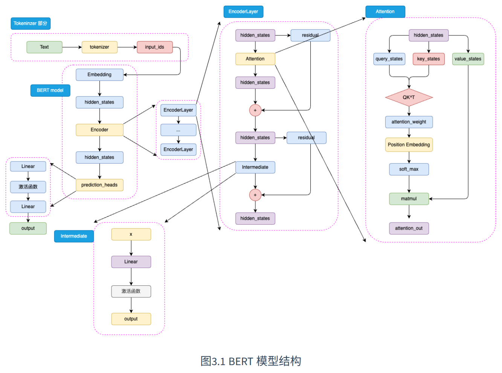
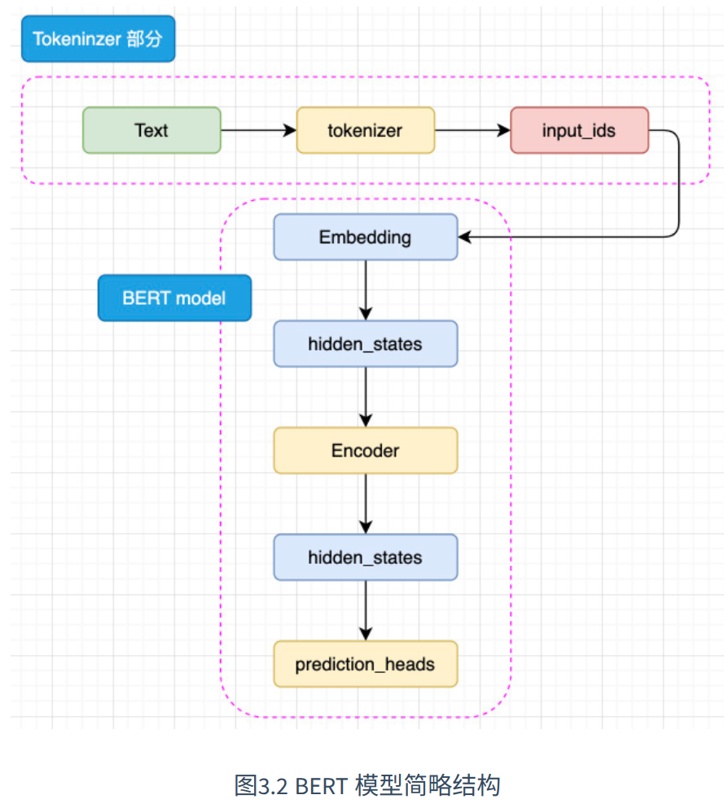
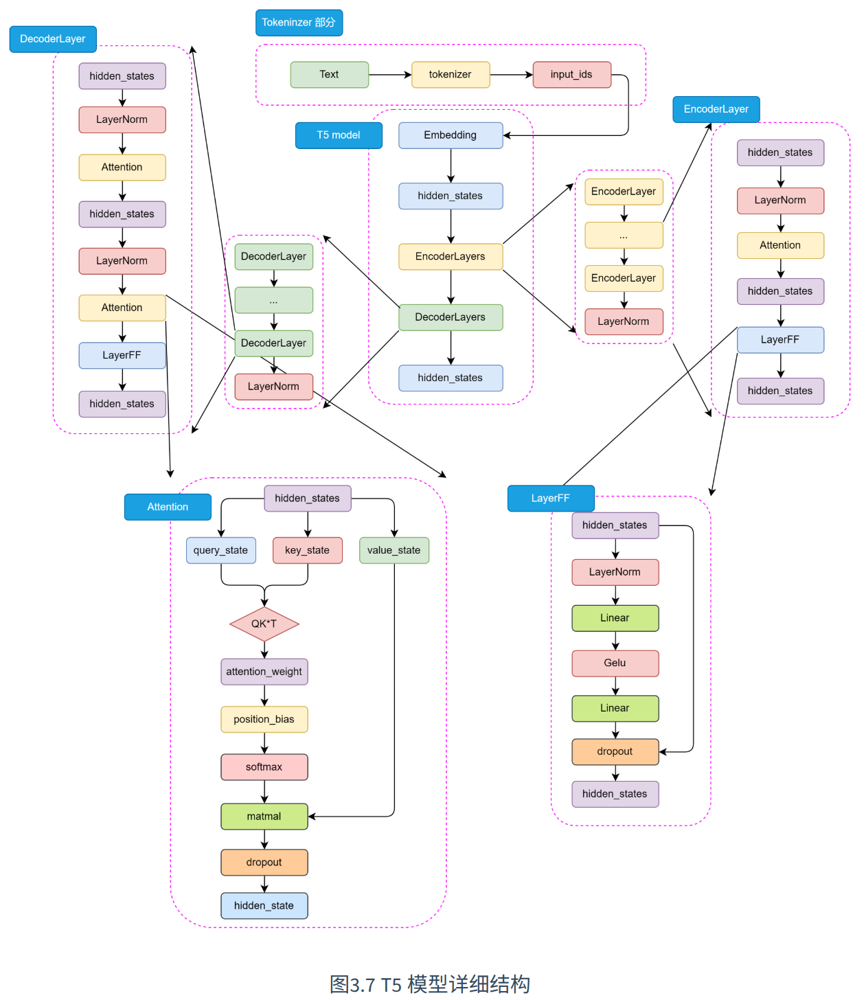
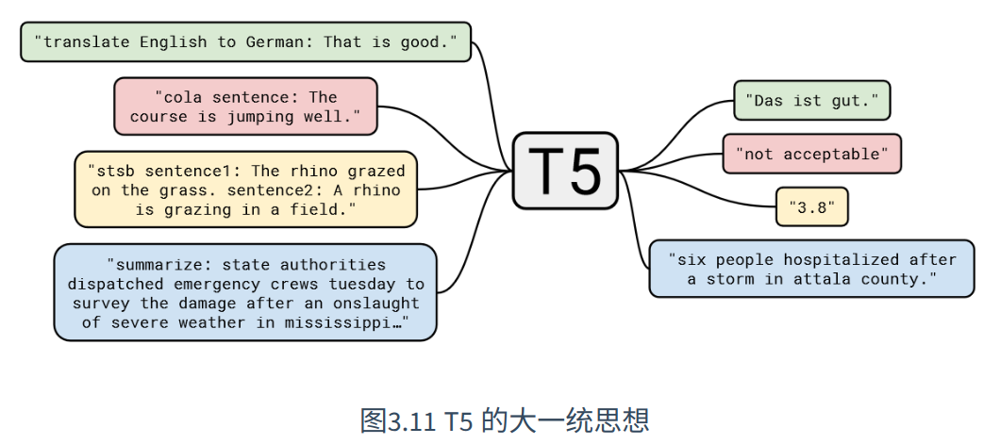
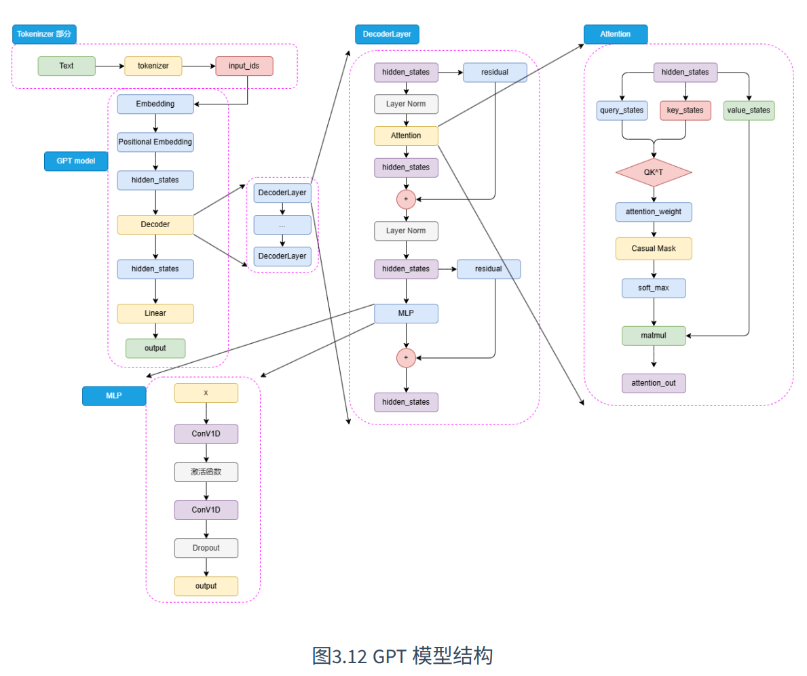
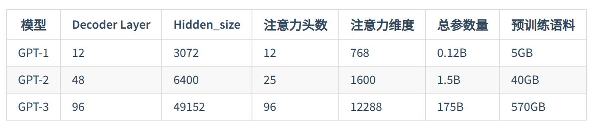
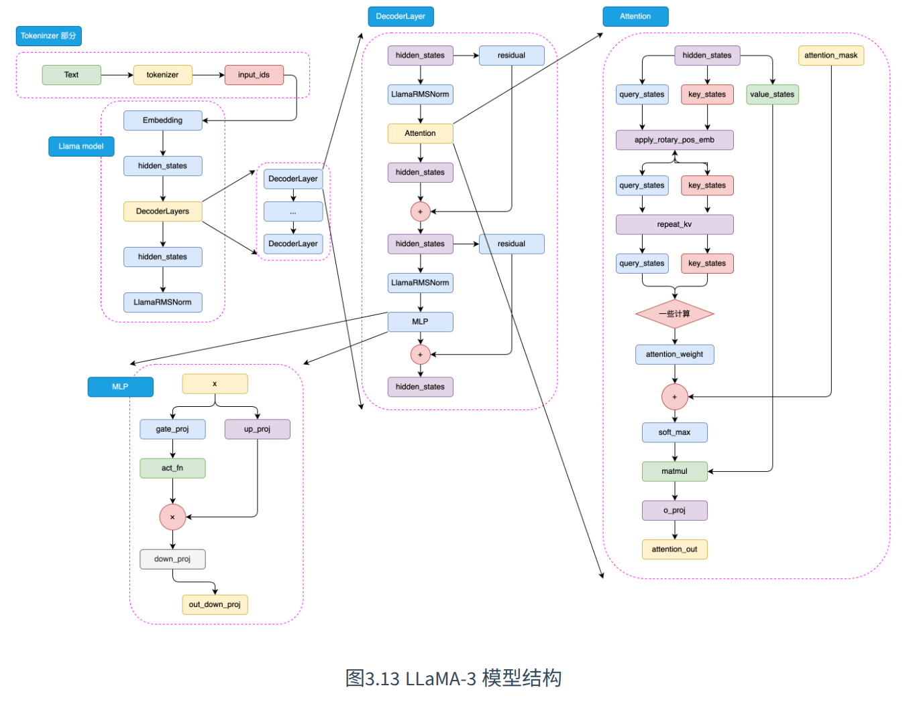

# 预训练语言模型

`Transformer` 由  `Encoder` 和 `Decoder` 两个, 两个部分具有不同的结果以及输入输出

针对于 `Encoder` 和 `Decoder` 的特点, 引入预训练的思路, 可以对于 `Transformer` 进行不同的优化 ; 例如 `Google` 选择 `Encoder` 层, 通过 `Encoder` 层的堆叠, 并且提出不同的预训练任务(`MLM + NSP`) , 打造了一统自然语言理解任务的代表模型 `Bert`, `OpenAI` 选择 `Decoder` 层, 使用原有的语言模型(`LM` 任务), 并且增加模型参数以及预训练语料, 打造了在 `NLG` 人物上优势明显的 `GPT` 系列模型 ; 另外一种保留 `Encoder` 和 `Decoder`, 通过预训练的 `Transformer`, 例如 `Google`发布的 `T5` 模型

## Encoder-only PLM

### Bert

> `Bert` 论文: https://arxiv.org/abs/1810.04805

#### 模型思想

`Bert` 是一个统一了多种思想的预训练模型, 核心思想包含:

- `Transformer` 架构, 保留了 `Encoder` 架构, 扩大了模型参数
- 预训练+微调范式

#### 模型架构



`Bert`一般针对于`NLU`任务, 输入一般是文本序列, 输出一般是 `label`, 同时利用 `Encoder` 堆叠而成的 `Bert` 本质上也是一个 `Seq2Seq` 的模型, 只是没有加入针对于特定任务的 `Decoder`, 所以为了适配各种 `NLU` 任务, 在模型顶层加一个分类头 `prediction_heads`, 用于把多维度的隐藏状态转换为分类维度

`Bert` 的简化架构如下:



`Bert` 存在两种规模的模型, 分别是 `base` 版本(`12` 层 `Encoder Layer`, `768` 层的隐藏层维度, 参数量为 `110M`) 以及 `large` 版本(`24` 层 `Encoder Layer`, `1024` 层隐藏维度)

`Bert` 中的 `Encoder` 和传统 `Transformer Encoder` 的不同之处体现在:

- 注意 `Bert` 使用的激活函数是 `GELU` 函数, 该激活函数的表达式如下:

$$
GELU(x) = 0.5x (1 + \tanh(\sqrt {\frac {2}{\pi}}(x + 0.44715x^3)))
$$

该激活函数的核心思想是将随机正则化的思想引入到激活函数中, 并且通过自身的概率分布, 来决定抛弃还是保留自身的神经元

- `Bert` 的注意力计算过程和 `Transformer Eoncoder` 不同, 在完成注意力分数计算之后, 首先通过 `Position Embedding` 层相对位置信息, 但是注意到这里的 `Position Embedding` 层, 其实是一层线性矩阵(`dim to dim`), 通过可训练的参数来拟合相对位置

#### 预训练任务(MLM + NSP)

`Bert` 和 双向 `LSTM/RNN` 可以拟合双向的语义关系的原因不同: 前者其实是使用了预训练任务 `MLM`,  后者使用了双向架构

`MLM` 的固定缺陷, 下游任务可能预训练任务不一致(`MLM` 相当于完形填空, 但是一般的 `LM` 任务模拟了人自然创作的过程), 对于 `MLM` 下游任务中不存在人工加入的 `<MASK>`, 可以直接通过原文本得到对应的隐状态在根据下游任务进入到分类器或者其他组件, 对于这一个问题, `MLM` 策略进行了一定的改进(15%的 `token` 屏蔽, 其中 80% 被标记为 `<MASK>`, 10% 替换为任意一个 `token`, 另外 `10%` 保持不变)

另外一个预训练任务`NSP`, 核心思想是针对于句级的理解(针对于问答匹配, 自然语言推理等任务); `NSP` 任务训练模型在句级关系上的拟合, `MLM` 任务提供在 `token` 级拟合的语义关系 ; `NSP` 的核心思想在于要求模型判断一个句子对是否为连续上下文(**注意到 `Bert` 的模型架构, 就是类似于一个分类模型, 所以给到 `Bert` 的任务最好是一个分类任务, 或者词预测的任务**)

#### 下游任务微调

针对于不同的下游`NLP`任务, 可以对于 `Bert` 进行不同程度的微调, 例如对于文本分类任务, 可以直接修改模型架构中的 `predicition_heads` ; 对于序列标注任务, 可以集成 `Bert` 多层的隐含层向量在输入最后的标注结果 ; 对于文本生成任务, 可以直接取 `Encoder` 的输出直接解码得到最终的结果

### RoBERTa

`RoBERTa`  是基于 `Bert` 的一种拓展模型, `RoBERTa` 在 `Bert` 的基础上做了如下优化(模型架构和 `Bert` 完全一样):

- 去除 `NSP` 预训练任务, 同时对于 `MLM` 任务进行了改进, `Mask` 的操作在数据处理的阶段完成, 每 `10` 个 `epoch` 做一次 `Mask` 处理, 也就是每 `10` 个 `epoch` 过程中使用的数据是一样的
- 更大规模的预训练数据和预训练步长(~~大力出奇迹~~)
- 更大的 `bpe` 词表(使用 `BPE` 作为 `Tokenizer` 的编码策略), 词表越大, 词之间的关系越能表现地更好

### ALBERT

`ALBERT` 基于 `Bert` 模型进行优化, 并且成功以更小规模的参数超过了 `Bert` 的能力, `ALBERT` 模型做的优化如下:

- 将 `Embedding` 参数进行分解,  在 `Embedding` 层后面加入一个线性矩阵降低 `Embedding` 层的维度,  例如词表大小为 `V`, 维度为 `H`,  首先利用 `word2vec` 嵌入词的维度为 `E`, 那么此时把 `Embedding` 参数量从 `V * H` 降低到 `V * E + E * H`
- 跨层进行参数共享: 对于 `Bert` 而言, 每一个 `Encoder` 层的参数高度一致, `ALBERT` 中, 让各个 `Encoder` 层共享参数从而减少模型参数量(但是由于还是需要对于 `Encoder Layer` 进行 `24` 次计算, 所以推理效率甚至相对于  `Bert` 更慢)
- 提出`SOP`预训练任务:  还是句子预测, 但是正例为连续两个句子, 负例为两个句子反过来

## Encoder-Decoder PLM

### T5

`T5` 模型是 `Google` 提出的一种预训练语言模型, 通过将所有的 `NLP` 任务表示成从文本到文本的转换问题, 基于 `Transformer` 架构, 包含 `Encoder` 和 `Decoder` 两个部分, 并且使用 `Self-Attention` 和 `Mulit-Head-Attention` 来捕捉全局依赖关系, 使用相对位置编码处理长序列中的位置信息, 并且在每一层中包含前馈神经网络进一步处理特征

#### 模型架构

`T5` 模型架构如下, 主要分为 `Tokeninzer` 部分以及 `EncoderLayers` 和 `DecoderLayers` 部分, 整体架构如下:



注意到 `T5` 与传统 `Transformer` 价格的不同之处:

- 模型的 `LayerNorm`(层归一化采用了 `RMSNorm`), 通过计算每一个神经元的均方根来归一化每一个隐藏层的激活值, 参数设置和 `LayerNorm` 相比更加简单, 只有一个可学习的参数:

$$
RMSNorm(x) = \frac {x}{\frac{1}{n} \sum_{i=1}^n x_i^2 + \epsilon} \gamma
$$

其中 $x_i$ 为输入向量的第 $i$ 个特征, $\gamma$ 是可以学习的缩放参数, $n$ 是输入向量的维度数量, $\epsilon$ 为小常数, 用于数据稳定性, `RMSNorm` 代码实现如下:

```Python
class RMSNorm(nn.Module):
    def __init__(self, dim, eps=1e-5):
        super(RMSNorm, self).__init__()
        self.dim = dim
        self.gamma = nn.Parameter(torch.ones(size=(dim,)))
        self.eps = eps
    def forward(self, X):
       # X.shape -> (batch_size, dim)
       p2 = X.square().sum(dim=-1,keepdim=True)
       div = torch.sqrt(p2/self.dim + self.eps)
       X = X / div * self.gamma
       return X
```

#### 预训练任务

`T5` 的预训练模型包含如下几个部分:

- 预训练任务: `T5` 模型的预训练任务是 `MLM`
- 输入格式: 预训练的时候, `T5` 将输入文本转换为文本到文本的格式, 对于一个给定的文本序列, 选择 `token` 进行遮蔽, 并且使用特殊的占位符号替代, 然后把被遮蔽的 `token` 作为模型的输出目的
- 预训练数据集: 使用自己创建的大规模数据集
- 多任务预训练: 尝试把多个任务混合在一起进行预训练
- 预训练到微调的转换: 预训练完成之后, `T5` 模型才会在下游任务上进行微调

#### 大一统思想

`T5` 的核心思想是大一统思想, 也就是所有的 `NLP` 任务都可以统一为文本到文本的任务 ; 可以把不同类型的 `NLP` 任务转换为一个统一的格式, 输入和输出都是纯文本(对于分类任务,  比如输入 `It is a great production` , 输出 `yes`) ; `T5` 模型利用这一种思想, 统一了预训练和微调阶段的任务的形式, 在各种设备上的适应性更强



对于不同任务, 每一次输入前都要加上一个任务描述前缀, 明确指定当前任务的类型

## Decoder-Only PLM

目前基本所有的 `LLM` 基本都是 `Decoder-Only` 模型(除了非 `Transformer` 架构的模型), 最经典的模型就是 `OpenAI` 的 `GPT`

### GPT

`GPT` 系列模型首先明确提出预训练-微调思想

#### 模型架构

`GPT`模型架构如下:



`Decoder-Only` 结构适合于文本生成的任务, 所以基于 `Decoder` 的模型 `GPT/T5` 更加适合文本生成或者 `seq2seq` 任务

另外 `GPT` 的前馈神经网络层没有选择线性矩阵来梯度特征, 而是选择了两个一维卷积核来提取(实际上是进一步提取序列之间的特征)

#### 预训练任务

`Decoder-Only` 模型结构适合文本生成任务, 选择了最传统的预训练任务 `CLM`, 也就是根据前 `N` 个 `token` 预测下一个 `token`

#### GPT系列模型

`GPT-1 ~ GPT-3` 模型结构以及预训练语料大小变化如下:



`GPT-2`  模型提出了 `zero-shot`, 也就是不对于模型进行微调, 直接要求模型解决任务, 也就是不使用任何训练样本, 直接通过向预训练语言模型来解决该问题 ; `GPT-3` 提出 `few-shot`, 也就是给模型少量的示例数据来教会模型完成任务, `few-shot` 一般会在 `prompt` 中增加 `3~5` 个示例, `zero-shot` 和 `few-shot` 对比如下:

```Text
zero-shot：请你判断‘这真是一个绝佳的机会’的情感是正向还是负向，如果是正向，输出1；否则输出0

few-shot：请你判断‘这真是一个绝佳的机会’的情感是正向还是负向，如果是正向，输出1；否则输出0。你可以参考以下示例来判断：‘你的表现非常好’——1；‘太糟糕了’——0；‘真是一个好主意’——1。
```

### LLaMA

`LLaMA` 模型由 `Meta` 开发, 并且在实际任务应用中拥有显著千潜力

#### 模型架构

`LLaMA` 模型架构如下:



### GLM

#### 模型架构-相对于GPT 的略微修正

`GLM` 模型和 `GPT` 模型的不同之处在于:

- 使用 `Post Norm`: 首先进行残差计算, 之后进行 `LayerNorm` 计算, 对参数正则化的效果更好, 和 `GPT` 使用的 `Pre Norm` 不同, 但是也会损失一部分特征的特性, 对于体量较大的模型一般任务 `Pre Norm` 效果更好, `Post Norm` 可能可以避免 `LLM` 数值错误
- 使用单个线性层而不是 `MLP` 实现最终 `token` 预测
- 激活函数从 `ReLU` 换成了 `GeLU`

#### 预训练任务-GLM

`GLM` 是一种新的预训练任务, 类似于 `MLM`, 但是 `GLM` 不像 `MLM` 一样遮蔽单个 `token`, 而是每一次遮蔽一连串的 `token`, 例如输入和输出可能如下:

```Text
输入：I <MASK> because you <MASK>
输出：<MASK> - love you; <MASK> - are a wonderful person
```

但是针对于超大规模、体量的预训练, `CLM` 展现超过 `MLM` 的优势, 所以最终 `ChatGLM` 系列模型还是最终回归到了传统的 `CLM` 预训练任务


