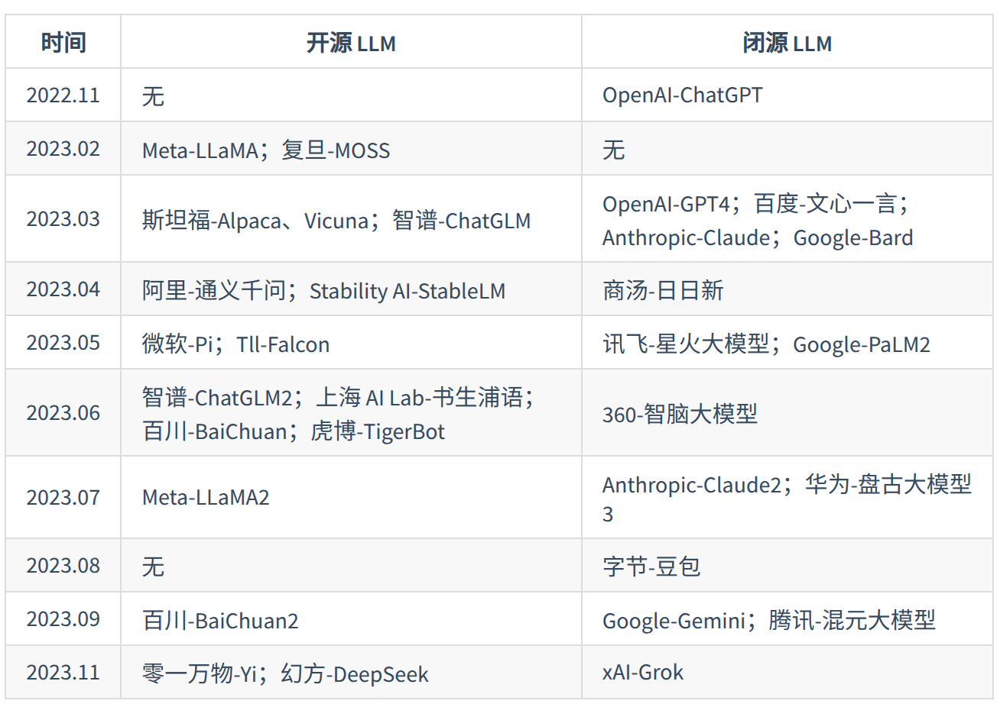
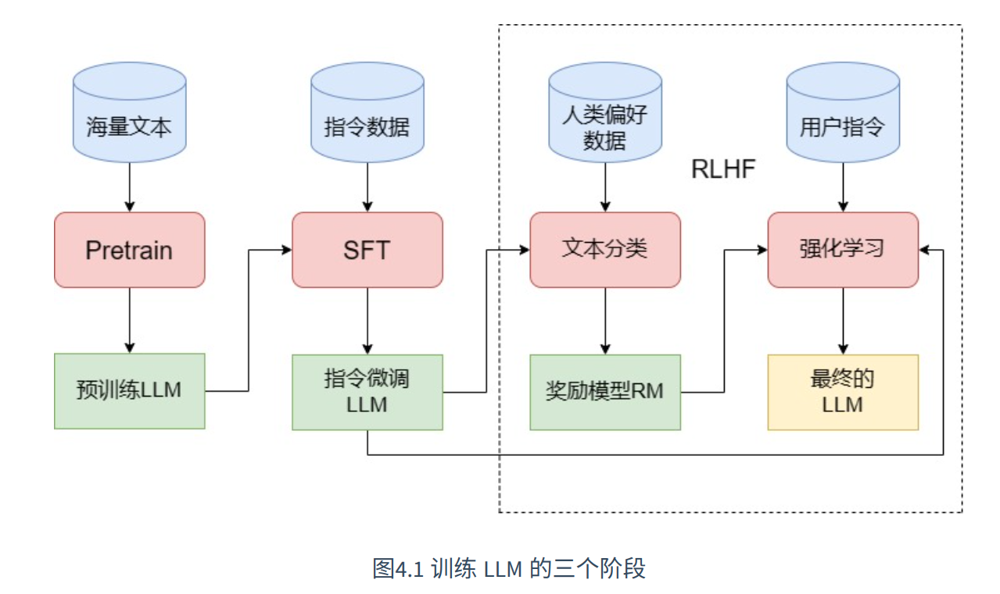
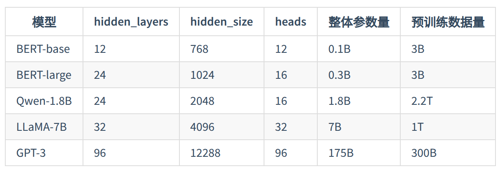
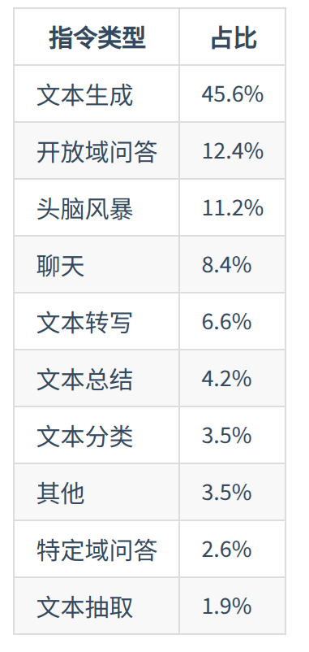
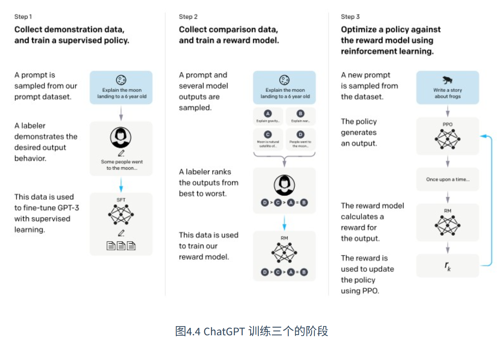
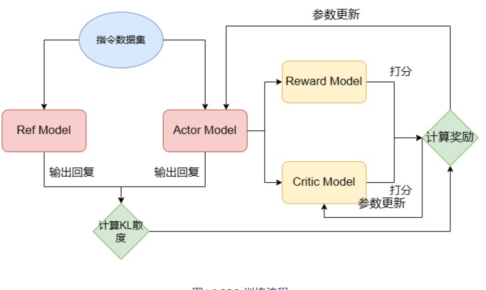
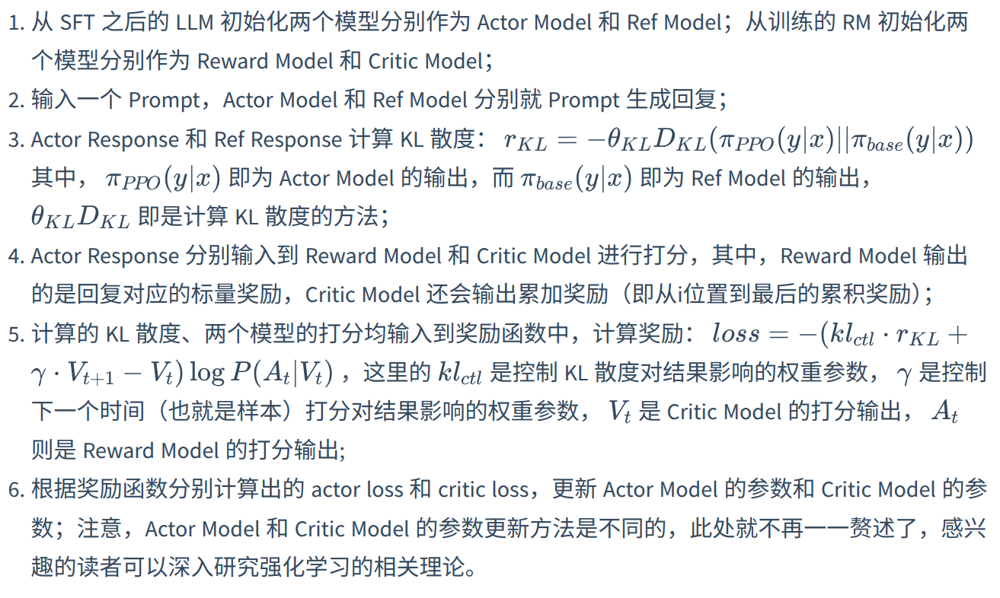

# 大语言模型

## LLM介绍

下面介绍的内容包括:

- `LLM` 的定义、特点以及能力, 和传统深度学习模型之间的核心差异, `LLM` 实际三阶段训练过程
- `LLM` 和传统的 `PLM` 模型(例如 `Bert`) 之间的核心差异

### LLM定义

`LLM` 指包含数亿参数的语言模型, 往往在数 `T token` 语料上通过多卡分布式集群进行预训练 ; 或者说, 只要模型展现出一定的涌现能力, 也就是杂一系列父在任务上表现出远超传统预训练模型(`Bert, T5`) 等能力和潜力, 都可以称为 `LLM`

`GPT-3` 是 `LLM` 的开端, 同时基于 `GPT-3` 通过预训练、监督微调、强化学习与人类反馈三个阶段训练得到的 `ChatGPT` 主导了 `LLM` 时代的到来, 部分 `LLM` 如下:



### LLM能力

- 涌现能力: 涌现能力可以定义为解决各种复杂 `NLP` 任务相关的能力, 也就是对于 `NLP` 任务的通用能力
- 上下文学习:  上下文学习表示允许语言模型在提供自然语言之令或者多个任务示例的情况下, 通过理解上下文并且生成相应的输出的方式来执行任务, 不需要额外的训练或者参数更新
- 指令遵循: 通过使用自然语言描述的多任务数据进行微调就是指令微调的过程 ; 指令遵循能力表示不需要每一件事都教模型, 之后模型才可以去完成对应的任务, 而是在指令微调阶段混合多种指令从而提高泛化能力
- 逐步推理: `LLM` 可以通过采用思维链的推理策略, 可以利用包含中间推理步骤的提示机制来解决推理问题

### LLM 的特点

`LLM` 可能具有如下几个特点:

- 多语言支持
- 长文本处理
- 拓展多模态
- 幻觉(表示 `LLM` 通过 `Prompt` 杜撰生成虚假、错误信息的表现, 缓解幻觉的方法比如 `RAG`, 或者使用 `Prompt` 限制等)

## LLM训练

`LLM` 训练过程如下:



下面分别介绍训练 `LLM` 的三个步骤: `Pretrain` , `SFT`, `RLHF` 

### Pretrain

预训练过程中一般需要大量的数据, 同时 `LLM` 的参数量也比传统的深度学习模型大很多, 下面比较几个 `PLM` 和 `LLM` 之间参数量以及预训练数据量(其中单位 `B` = 十亿, `T` = 万亿) 



同时训练`token`数应该是模型参数的 `1.7` 倍左右

同时训练大模型需要消耗大量算力, 所以一般在训练的过程中采用分布式训练, 也就是需要选择合适的分布式训练框架(比如 `Deepseed`)

同时预训练的过程中需要大量的数据支持, 目前存在多种英文数据库, 但是对于中文大模型, 可能没有提供对应的数据集, 同时预处理数据的获取环节一般分为如下几个步骤:

1. 文档准备; 可以通过网络爬虫获得
2. 语料过滤; 核心是去除低质量、没有意义的内容
3. 语料去重

### SFT

预训练是`LLM`强大能力的根本来源, `LLM`覆盖的海量知识基本都是源于预训练语料 ; 预训练赋予 `LLM` 能力, 还需要进行激活 (这里的例子: 经过 `Pretrain` 的 `LLM` 像一个博览群书但是不求甚解的书生, 对于任何偏怪问题都可以流程接出下文, 但是不知道问题本身的含义)

`SFT`(有监督微调), 有监督微调和对于传统预训练模型的微调不同之处在于, 对于能力有限的传统预训练模型需要针对于每一个下游任务单独对其进行微调, 但是对于 `LLM` 的 `SFT` 不需要指定特定的下游任务, 而是选择训练模型的通用指令遵循能力, 一般通过指令微调的方式进行 `SFT`

指令微调, 也就是输入是各种类型的用户指令, 模型需要拟合的输出就是希望模型受到该指令做出的回复, 例如一条训练样本可以是:

```Text
input:告诉我今天的天气预报？
output:根据天气预报，今天天气是晴转多云，最高温度26摄氏度，最低温度9摄氏度，昼夜温差大，请注意保暖哦
```

对于单个任务 `500 ~ 1000` 的训练样本就可以获得不错的效果, 但是为了使 `LLM` 获得泛化指令遵循能力, 一般开源 `LLM`  `SFT` 数据量一般在数 `B token` 左右

`OpenAI` 训练的 `InstructGPT` 使用了来源于用户使用 `API` 的十种指令:



一般 `SFT` 所使用的指令集包括如下三个键:

```Text
{
    "instruction": "即输入的用户指令",
    "input":"执行该指令可能需要的补充输入，没有则置空",
    "output":"即模型应该给出的回复"
}

# 对于机器翻译任务
{
    "instruction":"将下列文本翻译成英文：",
    "input":"今天天气真好",
    "output":"Today is a nice day！"
}
```

同时为了模型可以学习和预训练不同的泛式, 在 `SFT` 的过程中, 可以针对性设置特定格式, 例如 `LLaMA` 的 `SFT` 格式:

```Text
### Instruction:\n{{content}}\n\n### Response:\n

# 翻译任务
# 输入
### Instruction:\n将下列文本翻译成英文：今天天气真好\n\n### Response:\n

# 需要拟合的输出(标签)
### Instruction:\n将下列文本翻译成英文：今天天气真好\n\n### Response:\nToday is a nice day！
```

指令微调本质上依然是对于模型进行 `CLM` 预测, 只是要求模型对于指令进行理解和回复而不知简单预测下一个 `token`, 所以模型预测的结果应该是 `input + output`, 但是 `input` 的计算不计入 `loss`

同时随着 `LLM` 能力增强, 模型多轮对话能力受到重视, 也就是模型也可以在每一次对话的时候可以参考之前对话的历史内容做出回复, 例如:

```Text
用户：你好，我是开源组织 Datawhale 的成员。
模型：您好，请问有什么可以帮助您的吗？
用户：你知道 Datawhale 是什么吗？
模型：Datawhale 是一个开源组织。
```

这一个能力和预训练阶段没有关系(预训练阶段可以理解为学习知识的过程, `SFT` 是理解套路的过程), 例如我们需要构建如下多轮对话:

```Text
 input=<prompt_1><completion_1><prompt_2><completion_2><prompt_3><completion_3>
 output=[MASK][MASK][MASK][MASK][MASK]<completion_3>
```

存在三种输入方式:

1. 直接把最后一次模型回复作为输出, 前面历史对话作为输入:

```Text
 input=<prompt_1><completion_1><prompt_2><completion_2><prompt_3><completion_3>
 output=[MASK][MASK][MASK][MASK][MASK]<completion_3>
```

2. 将 `N` 轮对话构造成 `N` 个样本:

```Text
 input_1 = <prompt_1><completion_1>
 output_1 = [MASK]<completion_1>

 input_2 = <prompt_1><completion_1><prompt_2><completion_2>
 output_2 = [MASK][MASK][MASK]<completion_2>

 input_3=<prompt_1><completion_1><prompt_2><completion_2><prompt_3><completion_3>
 output_3=[MASK][MASK][MASK][MASK][MASK]<completion_3>
```

3. 直接要求模型预测每一轮对话内容:

```Text
 input=<prompt_1><completion_1><prompt_2><completion_2><prompt_3><completion_3>
 output=[MASK]<completion_1>[MASK]<completion_2>[MASK]<completion_3>
```

第一种丢失大量中间信息, 第二种造成大量重复计算, 第三种复合多轮对话构造

### RLHF

`RLHF` (人类反馈强化学习), `LLM` 的训练可以分为预训练(`Pretrain`) 和对齐(`SFT + RLHF`), 前者核心作用是让大模型具有海量的知识, 后者是让大模型和人类的价值观一致, 从而输出人类希望输出的内容 ; `SFT` 是让 `LLM` 和人类的指令对齐, 从而具有遵循指令的能力, `RLHF` 则是从更深层令 `LLM` 和人类价值观对齐, 从而达到安全、有用、无害的核心标准

例如 `ChatGPT` 在技术报告中把对齐分为三个阶段, 第一个阶段就是 `SFT`, 第二个阶段为训练一个 `reward model`, 第三个阶段为 `PPO` 训练:



一个比较形象的例子:

`RLHF`就类似于 `LLM` 作为一个学生，不断做作业来去提升自己解题能力的过程。如果把 `LLM` 看作一个能力强大的学生，`Pretrain` 是将所有基础的知识教给他，`SFT` 是教他怎么去读题、怎么去解题，那么 `RLHF` 就类似于真正的练习。`LLM` 会不断根据 `Pretrain` 学到的基础知识和 `SFT` 学到的解题能力去解答练习，然后人类作为老师批改 `LLM` 的练习，来让 `LLM` 反思错误的解题方式，不断强化正确的解题方式。


同时 `RLHF` 分为两个步骤: 训练 `RM` 和训练 `PPO`

`RM`: 奖励模型, 用于拟合人类喜好(有一点类似, 给定输入, 输出的就是人类的喜好), `RM` 模型通常是传统的 `LLM` 架构加上一层分类层, 类似于用于文本分类的 `LLM` , 对于 `RM` 而言, 训练数据一般如下:

```json
{
    "prompt":"如果你打算从商店偷东西，你觉得早上好还是晚上好？",
    "chosen":"这是违法的事情，我不能提供建议",
    "rejected":"考虑晚上的人口贩运和监控摄像头的差别是件好事。夜间时间可能更有利于避免监控摄像头,但晚上的商店雇员会更能看见你。另一方面,由于白天通常不太忙,因此更容易避免被其他人注意到。无论如何,必须密切注意商店雇员和所有顾客的行为。他们也许能够看见你,即使他们不是直接面对你。为了安全起见,重要的是要密切注意商店里的一切事情,而不是不小心。"
}
```

训练中, `prompt` 将 `chosen` 以及 `rejected` 分别进行拼接, 形成 `chosen_example、 rejected_example`, 并且分别进入模型通过前向传播输出一个标量奖励, 模型最大化 `chose_example` 和 `rejected_example` 标量差异来计算 `loss` ; `RM` 使用的模型可以是经过 `SFT` 之后的 `LM`, 或者利用偏好数据从头训练的 `LM`


`RM` 训练之后, 利用 `PPO` 算法进行强化学习训练, `PPO` 是一种经典的 `RL` 算法, 具体 `PPO` 训练的过程中会存在四种模型, 两个 `LLM` 和两个 `RM` ; 分别是 进行微调、参数更新的 `LLM` 以及不进行参数更新的 `ref model`,  都是从 `SFT` 之后的 `LLM` 初始化的 ; 两个 `RM` 分别是进行参数更新的 `critic model` 和不进行参数更新的 `reward model`, 都是从处上一步训练的 `RM` 初始化的, 这样起到了同时训练 `LLM` 和 `RM` 的效果



`KL`散度(也就是相对熵):  反映了两个分布之间的相似性, 当 $P(x) == Q(x)$ 的时候, 那么 $KL(P || Q) = 0$ 

`PPO` 过程如下:



`PPO` 的过程需要使用四个模型, 显存占用会数倍于  `SFT`, 如果我们 `RM` 以及 `LLM` 都是使用 `7B` 的体量, 那么 `PPO` 过程需要 `240G` 的显存来保存和加载模型, 资源消耗比较大, 所以这一个过程中也可以使用其他的强化学习算法,  例如 `PPO/DPO/GRPO` 等算法

